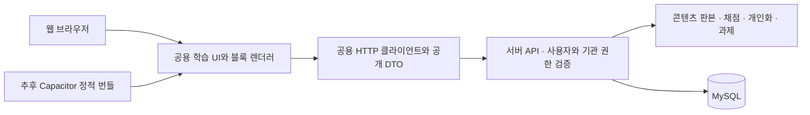

# 웹과 모바일을 함께 유지하는 구조

첫 구현은 웹 서비스다. 서랍처럼 같은 학습 화면을 Capacitor에 담을 수 있도록 정적 export를 검증한다. `out/`이 생성된다는 것은 브라우저 코드의 호환성을 뜻하며, 로그인 가능한 네이티브 앱 출시가 완료되었다는 뜻은 아니다.



## 처음부터 지킬 경계

- `src/shared`는 공개 DTO, `src/features`는 브라우저 화면과 HTTP 클라이언트를 담는다. 화면은 `src/server`, Prisma, 정답이 있는 콘텐츠 seed를 가져오지 않는다. 서버가 공개 콘텐츠와 채점 결과를 API로 전달한다.
- 개인화 클래스와 과제는 빌드 후에도 생성된다. 공용 학습 화면은 고정된 `/` 진입점의 상태·query로 대상 ID를 선택한다. 미리 생성할 수 없는 `[classId]` 경로나 요청에 의존하는 Server Component·Server Action을 학습 흐름의 필수 경로로 두지 않는다. `useSearchParams`가 필요해지면 `Suspense` 경계에 둔다.
- 웹은 같은 origin의 `/api`를 호출한다. 모바일은 빌드 시 지정한 HTTPS API origin을 사용한다. 미디어 주소 역시 이 경계를 통해 해석한다. 컴포넌트마다 API 주소를 조합하지 않는다.
- 그래프·도형 등 새 블록도 공용 렌더러에 추가한다. `kind`와 `typeVersion`으로 지원 여부를 판단하며, 미지원 필수 블록을 빈 화면이나 학습 완료로 처리하지 않는다. 대체 설명을 표시해도 해당 상호작용을 수행한 것으로 채점하지 않는다. 새 블록 발행은 구버전 앱의 렌더러 지원 범위를 고려해야 한다.
- 기기 전용 기능은 향후 별도 플랫폼 어댑터로 제공한다. 기능 사용 가능 여부를 확인하고 웹 대체 동작을 제공한다. 학습·채점 로직에서 Capacitor 플러그인을 직접 가져오지 않는다. 확대 가능한 SVG/Canvas, 터치와 키보드 조작, safe-area와 작은 화면 대응을 함께 유지한다.

## 모바일 호환 빌드

```sh
NEXT_PUBLIC_API_ORIGIN=https://your-api.example.com npm run build:mobile
```

`scripts/build-mobile.mjs`는 `.mobile-build/bundle-*` 임시 프로젝트에 다음 파일만 복사한다.

- `src/shared`, `src/features`의 실행 코드
- `src/app/page.tsx`, `layout.tsx`, `globals.css`
- `public`의 공개 자산

API 라우트, 서버 코드, 채점 코드·정답 seed, Prisma 설정, `.env`는 복사하지 않는다. `@/*` 별칭도 임시 프로젝트의 `src/*`로 바꾸므로 서버 디렉터리를 실수로 import하면 빌드가 실패한다. 새 브라우저 의존성을 추가하면 빌드 스크립트의 클라이언트 의존성 목록도 갱신한다.

임시 프로젝트는 이미 설치한 상위 `node_modules`를 사용하며, 정적 export는 Webpack으로 실행한다. 원본 소스를 이동하거나 API 폴더를 잠시 지우지 않는다. 빌드 성공 후에만 루트 `out/`을 교체하고 임시 프로젝트를 삭제한다. 웹의 `.next` 산출물도 건드리지 않는다.

API origin은 생략할 수 없다. HTTPS가 기본이고, 로컬 개발에서만 `MOBILE_ALLOW_LOCAL_API=1`과 HTTP loopback origin을 함께 지정할 수 있다. CI 또는 `NODE_ENV=production`에서는 이 예외를 허용하지 않는다. 실제 기기에서는 호스트 컴퓨터의 `127.0.0.1`에 접근할 수 없으므로 적절한 HTTPS 개발 API를 사용한다.

```sh
MOBILE_ALLOW_LOCAL_API=1 NEXT_PUBLIC_API_ORIGIN=http://127.0.0.1:3017 npm run build:mobile
```

CI의 `https://api.example.invalid`는 네트워크 호출 없이 정적 빌드만 검증하기 위한 예약된 예시 주소다. 이 산출물은 배포하지 않는다. `capacitor.config.ts`는 `webDir: 'out'`과 앱 식별자 초안만 정의한다. iOS/Android 프로젝트, 서명 키와 스토어 등록은 아직 생성하지 않는다.

## 인증과 제출의 후속 작업

현재 웹 인증은 서버가 관리하는 cookie를 사용한다. 네이티브 WebView에서 이 cookie 세션이 자동으로 공유된다고 가정하지 않는다. 모바일 출시에 앞서 네이티브 OAuth·딥링크 또는 id token 교환, 폐기 가능한 세션, 기기용 보안 저장소 어댑터, 로그인 복원 이후의 데이터 로딩을 구현해야 한다. 서버에서는 웹·모바일 요청 모두 같은 사용자·기관 권한 검증을 통과시킨다.

CORS는 실제 사용할 native origin의 정확한 허용 목록으로 구성하고 Authorization 요청과 OPTIONS를 처리한다. CORS 허용만으로 요청을 신뢰하지 않는다. 계정 전환·로그아웃 때 이전 사용자의 캐시와 대기 중 작업이 남지 않도록 한다.

오프라인 제출은 현재 제공하지 않는다. 네트워크 오류를 제출 성공으로 바꾸지 않고 서버 접수를 확인한 뒤 완료를 표시한다. 이후 초안·오프라인 큐를 도입하더라도 `pending`과 서버의 `submitted` 상태, 서버 접수 시각, 중복 재시도를 막는 request ID를 유지한다. 기관 과제의 고정 문항·마감 정책을 로컬 시계나 AI가 덮어쓸 수 없다.

## 서랍에서 참고한 부분과 적용 범위

서랍의 `next.config.ts`·`capacitor.config.ts`에서 웹 서버와 정적 번들 분리를, `src/lib/api/client.ts`에서 API origin과 토큰 경계를, `src/lib/native/capabilities.ts`에서 기기 기능 감지를 참고했다. `src/app/friends/profile/page.tsx`의 정적 경로+query 방식은 이후 생성되는 개인 클래스에도 맞는다.

서랍의 소스 폴더 이동식 모바일 빌드, Preferences에 저장한 장기 Bearer JWT, hostname만으로 localhost를 허용하는 CORS는 그대로 복사하지 않는다. 이 프로젝트에서는 임시 복사 빌드를 사용하고 모바일 인증·정확한 CORS 정책은 별도로 구현한다.

OTA는 아직 도입하지 않는다. 도입 시 앱 번들 판본, 콘텐츠 판본, API 호환 범위, 최소 native 버전, 무결성 확인·롤백을 함께 설계한다. 플러그인·권한 등 네이티브 변경은 별도 스토어 빌드가 필요하며, 콘텐츠 편집·발행과 앱 코드 업데이트는 서로 다른 절차다.

공식 근거: [Next.js 정적 export의 지원 범위](https://nextjs.org/docs/app/guides/static-exports), [Capacitor Preferences의 저장 범위와 한계](https://capacitorjs.com/docs/apis/preferences).
